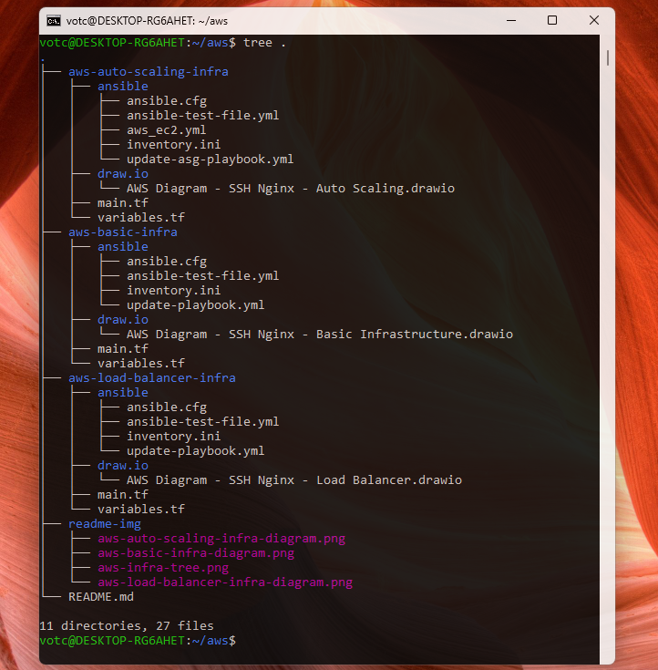

## AWS Basic, Load Balancer and Auto Scaling - Infra

- AWS Basic Infrastructure
- AWS Load Balancer Infrasctructure
- AWS Auto Scaling - Infrastructure

Under construction - I will prepare the README.md file this weekend ...

Each of them will have its own README.md

Everything is working. In this document I will describe all the steps to use them.

  

