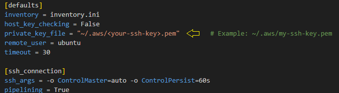

<i>P.S.:
- Make sure you choose the appropriate AMI image.</i>

## AWS Templates for:

- <a href="aws-basic-infra/README.md">Basic Infrastructure</a>
- <a href="aws-load-balancer-infra/README.md">Load Balancer Infrasctructure</a>
- <a href="aws-auto-scaling-infra/README.md">Auto Scaling Infrastructure</a>

<hr>

### Requirements:

- AWS CLI
- Terraform
- Ansible
- 01 Key Pair (EC2)

<i>P.S.: If you are using any APT GNU/Linux distribution, you can install them using my <a href="https://github.com/rodneyazev/just-a-devops-toolkit-wsl-linux">just-a-devops-toolkit-wsl-linux</a></i>

<hr>

<p align="center">
  
</p>

<hr>

### Changes you will need to manage:

- ### Create an SSH key pair on EC2

<i>You can create it through EC2 Dashboard:</i>


<i>Or importing it:</i>


```
# Create SSH Key Pair

ssh-keygen -t rsa -b 2048 -f <my-ssh-key>.pem
```

<i>You will need to create a public key equivalent:</i>

```
# Generate public key from your private key

ssh-keygen -y -f ../.aws/<my-ssh-key>.pem > ../.aws/<my-ssh-key>.pem.pub
```

- ### Parameter values:

```variables.tf:```

 

```ansible.cfg```



```inventory.ini```
<br><i>Only if needed. Check the main Infrastructure README.md file for more details.</i>

