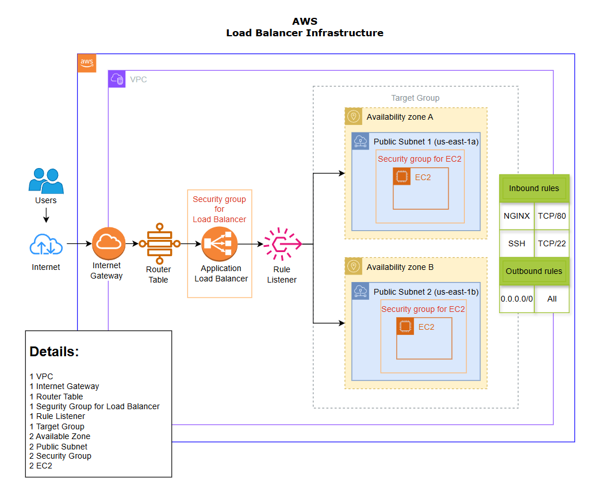
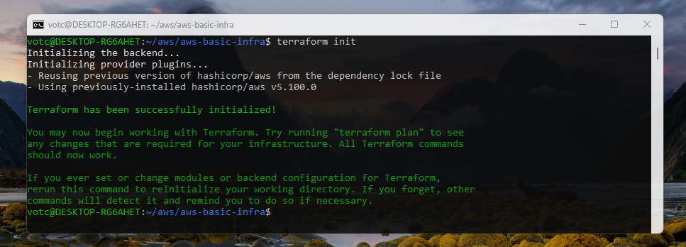
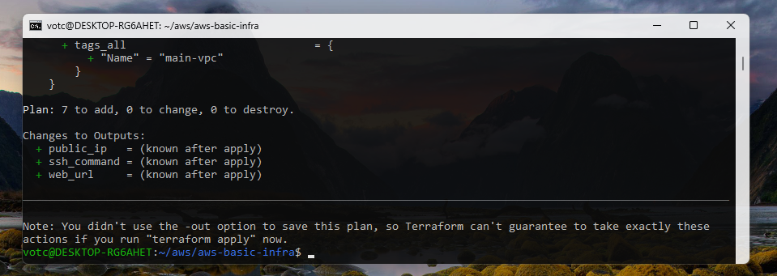
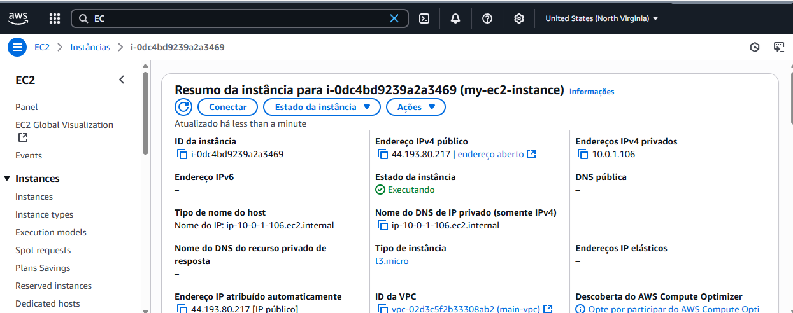

P.S.: Make sure you already have the requirements mentioned in the root of this repository (create the key pair, etc).

<p align="center">
  
</p>

<hr>

### AWS Load Balancer Infrastructure Diagram:

<p align="center">
  
</p>

## Using Terraform

Initialize Terraform<br>
```terraform init```


Generate execution plan<br>
```terraform plan```


Creates or updates infrastructure<br>
```terraform apply```


#### <i>Don't forget to destroy your infrastructure at the end to avoid unnecessary costs</i><br>```terraform destroy```


## Verifying Load Balancer Operation


## Verify that your your instances have started and test your accesses (SSH and Nginx)
You can do this through EC2 Dashboard or running the following AWS cli command:<br>
```aws ec2 describe-instance-status```

Checking via AWS EC2 Dashboard:


## SSH and Nginx validation
<i>Confirm your instances public IPs<br>You can validate via console or EC2 Dashboard</i>

```
# Get your public IPs

aws ec2 describe-instances --query 'Reservations[].Instances[].PublicIpAddress' --output text
```

```
# If you need to get your private IPs

aws ec2 describe-instances --query 'Reservations[].Instances[].PrivateIpAddress' --output text
```


<br>

<i>Clicking on your instances IDs</i>


<br><br>
SSH and Nginx test

<br><br>

```
http://<get-any-instance-public-ip>

# or

<your load balancer url>
e.g.: http://nginx-lb-588464347.us-east-1.elb.amazonaws.com
```


## Using Ansible

<i>At this moment we are using only Ansible to update/upgrade whole system.<br>
We also will send a file to main hosts folder to make sure Ansible is working.</i>

### Easy way

- Get your public IPs and change your inventory.ini file (ansible)
<br><br>
<br>

- Let's see if your hosts are visible

```
ansible all -m ping -i ansible/inventory.ini
```
<br>

- Update / Upgrade your instances and push a text file to your hosts, using Ansible

```
ansible-playbook -i ansible/inventory.ini ansible/update-playbook.yml ansible/ansible-test-file.yml
```

<br>

<br>

<br>


### "Hard" way
<i>Including the public IPs in the inventory.ini file is not necessary in this case.</i>

- Let's see if your hosts are visible

```
ansible all -m ping -i $(aws ec2 describe-instances --instance-ids $INSTANCE_IDS --query "Reservations[*].Instances[*].PublicIpAddress" --output text | tr '\n' ',') -e "ansible_ssh_private_key_file=~/.aws/my-ssh-key-votc.pem" -e "ansible_user=ubuntu" -e "ansible_ssh_common_args='-o StrictHostKeyChecking=no'"
```

<br>

- Update / Upgrade your instances and push a text file to your hosts, using Ansible

```
ansible-playbook ansible/update-playbook.yml ansible/ansible-test-file.yml -i $(aws ec2 describe-instances --instance-ids $INSTANCE_IDS --query "Reservations[*].Instances[*].PublicIpAddress" --output text | tr '\n' ',') -e "ansible_ssh_private_key_file=~/.aws/my-ssh-key-votc.pem" -e "ansible_user=ubuntu" -e "ansible_ssh_common_args='-o StrictHostKeyChecking=no'"
```

<br>


That's it.